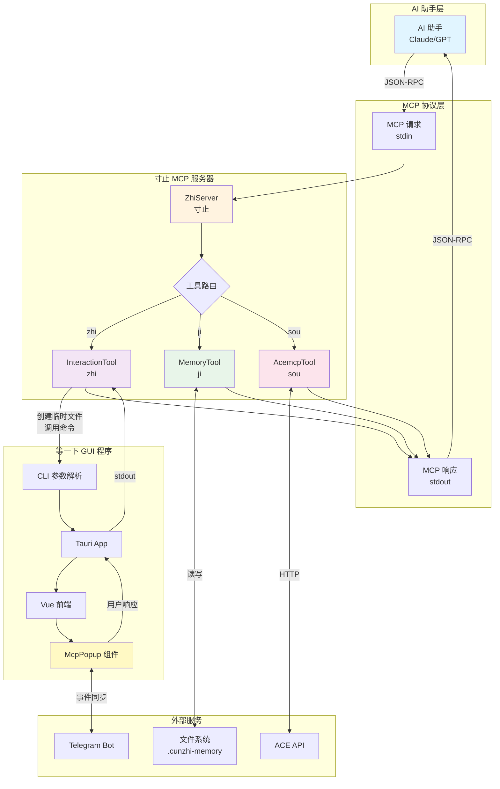
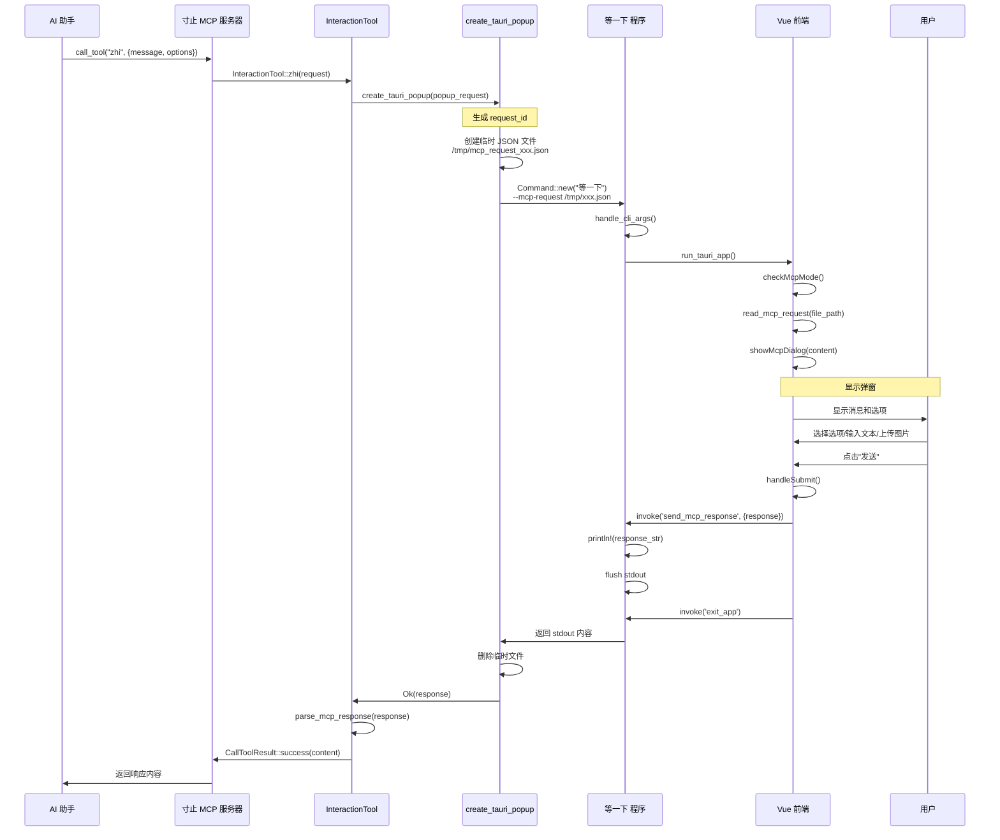
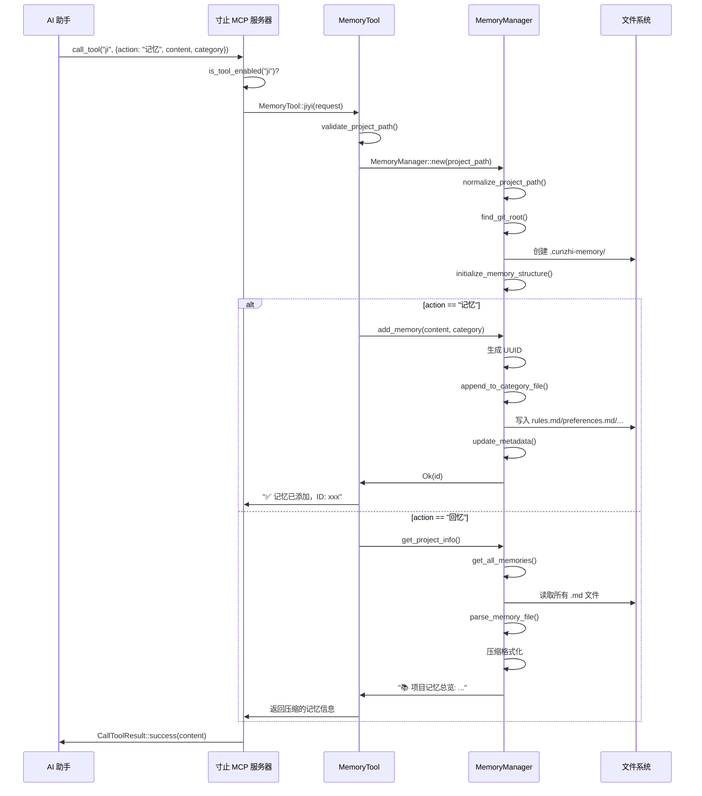
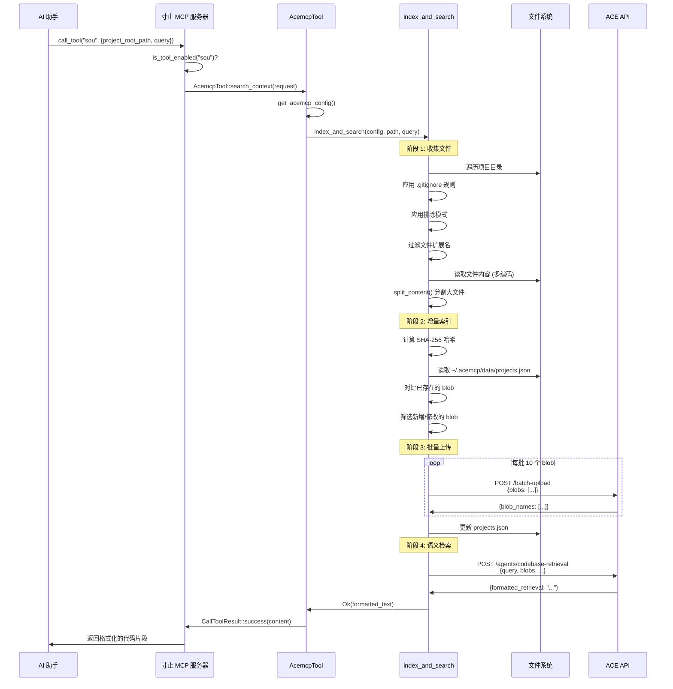
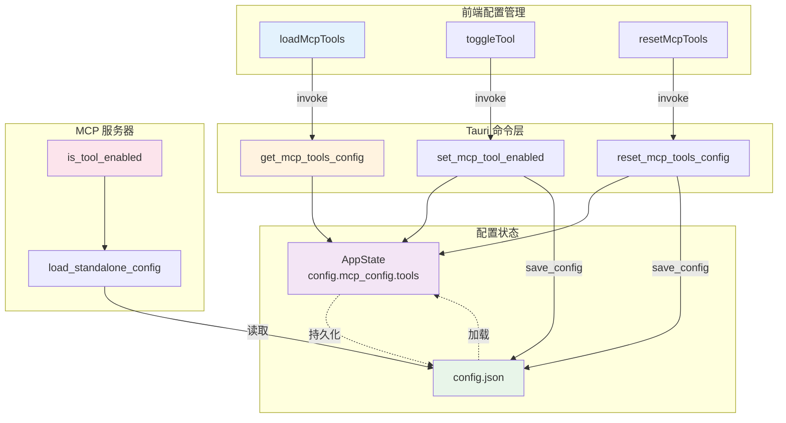

# 寸止项目核心词汇调用链路深度分析

## 📋 目录

1. [核心词汇定义位置](#1-核心词汇定义位置)
2. [词汇调用流程详解](#2-词汇调用流程详解)
3. [前端调用机制](#3-前端调用机制)
4. [Rust后端处理流程](#4-rust后端处理流程)
5. [回调机制分析](#5-回调机制分析)
6. [完整调用链路图](#6-完整调用链路图)

---

## 1. 核心词汇定义位置

### 1.1 应用程序名称

**文件**: `@/Users/jacobzha/Documents/workspace/jacob-open-source/cunzhi/src/rust/constants/app.rs:4-7`

```rust
/// 应用程序名称
pub const NAME: &str = "寸止";

/// 应用程序英文名称
pub const NAME_EN: &str = "cunzhi";
```

**文件**: `@/Users/jacobzha/Documents/workspace/jacob-open-source/cunzhi/Cargo.toml:10-16`

```toml
[[bin]]
name = "等一下"
path = "src/rust/main.rs"

[[bin]]
name = "寸止"
path = "src/rust/bin/mcp_server.rs"
```

### 1.2 MCP 工具 ID

**文件**: `@/Users/jacobzha/Documents/workspace/jacob-open-source/cunzhi/src/rust/constants/mcp.rs:3-10`

```rust
/// 寸止工具标识符
pub const TOOL_ZHI: &str = "zhi";

/// 记忆管理工具标识符
pub const TOOL_JI: &str = "ji";

/// 代码搜索工具标识符
pub const TOOL_SOU: &str = "sou";
```

### 1.3 工具配置

**文件**: `@/Users/jacobzha/Documents/workspace/jacob-open-source/cunzhi/src/rust/constants/mcp.rs:59-74`

```rust
impl Default for McpConfig {
    fn default() -> Self {
        Self {
            tools: vec![
                McpToolConfig::new(TOOL_ZHI, true, false),  // 寸止工具不可禁用
                McpToolConfig::new(TOOL_JI, false, true),   // 记忆管理工具可禁用，默认关闭
                McpToolConfig::new(TOOL_SOU, false, true),  // 代码搜索工具可禁用，默认关闭
            ],
            // ...
        }
    }
}
```

---

## 2. 词汇调用流程详解

### 2.1 "等一下" 可执行文件

**定义**: 主 Tauri 应用程序
**路径**: [src/rust/main.rs](cci:7://file:///Users/jacobzha/Documents/workspace/jacob-open-source/cunzhi/src/rust/main.rs:0:0-0:0)
**用途**: 
- 启动 GUI 设置界面
- 处理 MCP 请求弹窗
- 响应用户交互

**启动流程**:

```rust
// src/rust/main.rs
fn main() -> Result<()> {
    // 初始化日志系统
    auto_init_logger()?;
    
    // 处理命令行参数
    handle_cli_args()
}
```

**命令行参数处理** (`@/Users/jacobzha/Documents/workspace/jacob-open-source/cunzhi/src/rust/app/cli.rs:8-41`):

```rust
pub fn handle_cli_args() -> Result<()> {
    let args: Vec<String> = std::env::args().collect();
    
    match args.len() {
        // 无参数：正常启动GUI
        1 => run_tauri_app(),
        
        // 单参数：帮助或版本
        2 => match args[1].as_str() {
            "--help" | "-h" => print_help(),
            "--version" | "-v" => print_version(),
            _ => { /* 错误处理 */ }
        },
        
        // 多参数：MCP请求模式
        _ => {
            if args[1] == "--mcp-request" && args.len() >= 3 {
                handle_mcp_request(&args[2])?;
            }
        }
    }
    Ok(())
}
```

### 2.2 "寸止" MCP 服务器

**定义**: 独立的 MCP 服务器可执行文件
**路径**: [src/rust/bin/mcp_server.rs](cci:7://file:///Users/jacobzha/Documents/workspace/jacob-open-source/cunzhi/src/rust/bin/mcp_server.rs:0:0-0:0)
**用途**: 作为 MCP 服务器运行，通过 stdio 与 AI 助手通信

**启动流程** (`@/Users/jacobzha/Documents/workspace/jacob-open-source/cunzhi/src/rust/bin/mcp_server.rs:4-11`):

```rust
#[tokio::main]
async fn main() -> Result<(), Box<dyn std::error::Error>> {
    // 自动初始化日志系统
    auto_init_logger()?;
    
    log_important!(info, "启动 MCP 服务器");
    run_server().await
}
```

### 2.3 "zhi" 工具调用

**定义**: 交互式弹窗工具
**调用者**: AI 助手通过 MCP 协议
**处理器**: [InteractionTool::zhi()](cci:1://file:///Users/jacobzha/Documents/workspace/jacob-open-source/cunzhi/src/rust/mcp/tools/interaction/mcp.rs:14:4-38:5)

**调用链路**:

```
AI 助手 
  → MCP 请求 (stdin)
  → ZhiServer::call_tool()
  → InteractionTool::zhi()
  → create_tauri_popup()
  → 调用 "等一下" 程序
  → 显示 GUI 弹窗
  → 用户交互
  → 返回响应 (stdout)
  → AI 助手
```

### 2.4 "ji" 工具调用

**定义**: 记忆管理工具
**调用者**: AI 助手通过 MCP 协议
**处理器**: [MemoryTool::jiyi()](cci:1://file:///Users/jacobzha/Documents/workspace/jacob-open-source/cunzhi/src/rust/mcp/tools/memory/mcp.rs:13:4-60:5)

**调用链路**:

```
AI 助手
  → MCP 请求 {"action": "记忆", "content": "...", "category": "rule"}
  → ZhiServer::call_tool()
  → MemoryTool::jiyi()
  → MemoryManager::add_memory()
  → 写入 .cunzhi-memory/rules.md
  → 返回成功响应
  → AI 助手
```

### 2.5 "sou" 工具调用

**定义**: 代码搜索工具
**调用者**: AI 助手通过 MCP 协议
**处理器**: [AcemcpTool::search_context()](cci:1://file:///Users/jacobzha/Documents/workspace/jacob-open-source/cunzhi/src/rust/mcp/tools/acemcp/mcp.rs:26:4-49:5)

**调用链路**:

```
AI 助手
  → MCP 请求 {"project_root_path": "...", "query": "..."}
  → ZhiServer::call_tool()
  → AcemcpTool::search_context()
  → 收集代码文件
  → 计算哈希值
  → 批量上传到 ACE API
  → 执行语义检索
  → 返回格式化代码片段
  → AI 助手
```

---

## 3. 前端调用机制

### 3.1 MCP 工具管理

**文件**: `@/Users/jacobzha/Documents/workspace/jacob-open-source/cunzhi/src/frontend/composables/useMcpTools.ts`

**核心功能**:

```typescript
// 加载工具配置
async function loadMcpTools() {
    const tools = await invoke('get_mcp_tools_config') as MCPToolConfig[]
    mcpTools.value = tools
}

// 切换工具状态
async function toggleTool(toolId: string) {
    await invoke('set_mcp_tool_enabled', {
        toolId,
        enabled: newEnabled,
    })
    tool.enabled = newEnabled
}
```

**调用的 Rust 命令**:
- [get_mcp_tools_config](cci:1://file:///Users/jacobzha/Documents/workspace/jacob-open-source/cunzhi/src/rust/mcp/commands.rs:21:0-72:1) → `@/Users/jacobzha/Documents/workspace/jacob-open-source/cunzhi/src/rust/mcp/commands.rs:24-73`
- [set_mcp_tool_enabled](cci:1://file:///Users/jacobzha/Documents/workspace/jacob-open-source/cunzhi/src/rust/mcp/commands.rs:74:0-102:1) → `@/Users/jacobzha/Documents/workspace/jacob-open-source/cunzhi/src/rust/mcp/commands.rs:76-103`

### 3.2 MCP 请求处理

**文件**: `@/Users/jacobzha/Documents/workspace/jacob-open-source/cunzhi/src/frontend/composables/useMcpHandler.ts`

**核心流程**:

```typescript
// 1. 检查 MCP 模式
async function checkMcpMode() {
    const args = await invoke('get_cli_args')
    if (args && args.mcp_request) {
        const content = await invoke('read_mcp_request', { 
            filePath: args.mcp_request 
        })
        await showMcpDialog(content)
    }
}

// 2. 显示弹窗
async function showMcpDialog(request: any) {
    mcpRequest.value = request
    showMcpPopup.value = true
    
    // 播放音频通知
    await invoke('play_notification_sound')
    
    // 启动 Telegram 同步
    await invoke('start_telegram_sync', {...})
}

// 3. 处理响应
async function handleMcpResponse(response: any) {
    await invoke('send_mcp_response', { response })
    await invoke('exit_app')
}
```

### 3.3 弹窗组件

**文件**: `@/Users/jacobzha/Documents/workspace/jacob-open-source/cunzhi/src/frontend/components/popup/McpPopup.vue`

**关键方法**:

```typescript
// 提交响应
async function handleSubmit() {
    const response = {
        user_input: userInput.value.trim() || null,
        selected_options: selectedOptions.value,
        images: draggedImages.value.map(imageData => ({
            data: imageData.split(',')[1],
            media_type: 'image/png',
            filename: null,
        })),
        metadata: {
            timestamp: new Date().toISOString(),
            request_id: props.request?.id || null,
            source: 'popup',
        },
    }
    
    await invoke('send_mcp_response', { response })
    await invoke('exit_app')
}

// 继续操作
async function handleContinue() {
    const response = {
        user_input: continuePrompt.value,  // "请按照最佳实践继续"
        selected_options: [],
        images: [],
        metadata: {
            timestamp: new Date().toISOString(),
            request_id: props.request?.id || null,
            source: 'popup_continue',
        },
    }
    
    await invoke('send_mcp_response', { response })
    await invoke('exit_app')
}
```

---

## 4. Rust后端处理流程

### 4.1 MCP 服务器核心

**文件**: `@/Users/jacobzha/Documents/workspace/jacob-open-source/cunzhi/src/rust/mcp/server.rs`

**服务器结构**:

```rust
pub struct ZhiServer {
    enabled_tools: HashMap<String, bool>,
}

impl ServerHandler for ZhiServer {
    // 1. 获取服务器信息
    fn get_info(&self) -> ServerInfo {
        ServerInfo {
            protocol_version: ProtocolVersion::V_2024_11_05,
            capabilities: ServerCapabilities::builder().enable_tools().build(),
            server_info: Implementation {
                name: "Zhi-mcp".to_string(),
                version: env!("CARGO_PKG_VERSION").to_string(),
            },
            instructions: Some("Zhi 智能代码审查工具，支持交互式对话和记忆管理".to_string()),
        }
    }
    
    // 2. 列出可用工具
    async fn list_tools(...) -> Result<ListToolsResult, McpError> {
        let mut tools = Vec::new();
        
        // 寸止工具 (始终可用)
        tools.push(Tool {
            name: Cow::Borrowed("zhi"),
            description: Some(Cow::Borrowed("智能代码审查交互工具...")),
            input_schema: Arc::new(schema_map),
            annotations: None,
        });
        
        // 记忆管理工具 (可选)
        if self.is_tool_enabled("ji") {
            tools.push(Tool { name: Cow::Borrowed("ji"), ... });
        }
        
        // 代码搜索工具 (可选)
        if self.is_tool_enabled("sou") {
            tools.push(AcemcpTool::get_tool_definition());
        }
        
        Ok(ListToolsResult { tools, next_cursor: None })
    }
    
    // 3. 调用工具
    async fn call_tool(...) -> Result<CallToolResult, McpError> {
        match request.name.as_ref() {
            "zhi" => {
                let zhi_request: ZhiRequest = serde_json::from_value(arguments_value)?;
                InteractionTool::zhi(zhi_request).await
            }
            "ji" => {
                if !self.is_tool_enabled("ji") {
                    return Err(McpError::internal_error("记忆管理工具已被禁用", None));
                }
                let ji_request: JiyiRequest = serde_json::from_value(arguments_value)?;
                MemoryTool::jiyi(ji_request).await
            }
            "sou" => {
                if !self.is_tool_enabled("sou") {
                    return Err(McpError::internal_error("代码搜索工具已被禁用", None));
                }
                let acemcp_request: AcemcpRequest = serde_json::from_value(arguments_value)?;
                AcemcpTool::search_context(acemcp_request).await
            }
            _ => Err(McpError::invalid_request(format!("未知的工具: {}", request.name), None))
        }
    }
}
```

### 4.2 工具实现

#### 4.2.1 寸止工具 (zhi)

**文件**: `@/Users/jacobzha/Documents/workspace/jacob-open-source/cunzhi/src/rust/mcp/tools/interaction/mcp.rs`

```rust
impl InteractionTool {
    pub async fn zhi(request: ZhiRequest) -> Result<CallToolResult, McpError> {
        let popup_request = PopupRequest {
            id: generate_request_id(),
            message: request.message,
            predefined_options: if request.predefined_options.is_empty() {
                None
            } else {
                Some(request.predefined_options)
            },
            is_markdown: request.is_markdown,
        };
        
        match create_tauri_popup(&popup_request) {
            Ok(response) => {
                let content = parse_mcp_response(&response)?;
                Ok(CallToolResult::success(content))
            }
            Err(e) => Err(popup_error(e.to_string()).into())
        }
    }
}
```

**弹窗创建** (`@/Users/jacobzha/Documents/workspace/jacob-open-source/cunzhi/src/rust/mcp/handlers/popup.rs:11-42`):

```rust
pub fn create_tauri_popup(request: &PopupRequest) -> Result<String> {
    // 1. 创建临时请求文件
    let temp_dir = std::env::temp_dir();
    let temp_file = temp_dir.join(format!("mcp_request_{}.json", request.id));
    let request_json = serde_json::to_string_pretty(request)?;
    fs::write(&temp_file, request_json)?;
    
    // 2. 查找 "等一下" 命令
    let command_path = find_ui_command()?;
    
    // 3. 调用 "等一下" 命令
    let output = Command::new(&command_path)
        .arg("--mcp-request")
        .arg(temp_file.to_string_lossy().to_string())
        .output()?;
    
    // 4. 清理临时文件
    let _ = fs::remove_file(&temp_file);
    
    // 5. 返回响应
    if output.status.success() {
        let response = String::from_utf8_lossy(&output.stdout);
        Ok(response.trim().to_string())
    } else {
        let error = String::from_utf8_lossy(&output.stderr);
        anyhow::bail!("UI进程失败: {}", error);
    }
}
```

#### 4.2.2 记忆工具 (ji)

**文件**: `@/Users/jacobzha/Documents/workspace/jacob-open-source/cunzhi/src/rust/mcp/tools/memory/mcp.rs`

```rust
impl MemoryTool {
    pub async fn jiyi(request: JiyiRequest) -> Result<CallToolResult, McpError> {
        // 验证路径
        validate_project_path(&request.project_path)?;
        
        let manager = MemoryManager::new(&request.project_path)?;
        
        let result = match request.action.as_str() {
            "记忆" => {
                let category = match request.category.as_str() {
                    "rule" => MemoryCategory::Rule,
                    "preference" => MemoryCategory::Preference,
                    "pattern" => MemoryCategory::Pattern,
                    "context" => MemoryCategory::Context,
                    _ => MemoryCategory::Context,
                };
                
                let id = manager.add_memory(&request.content, category)?;
                format!("✅ 记忆已添加，ID: {}\n📝 内容: {}\n📂 分类: {:?}", 
                        id, request.content, category)
            }
            "回忆" => {
                manager.get_project_info()?
            }
            _ => return Err(McpError::invalid_params(
                format!("未知的操作类型: {}", request.action), None
            ))
        };
        
        Ok(CallToolResult::success(vec![Content::text(result)]))
    }
}
```

#### 4.2.3 搜索工具 (sou)

**文件**: `@/Users/jacobzha/Documents/workspace/jacob-open-source/cunzhi/src/rust/mcp/tools/acemcp/mcp.rs`

```rust
impl AcemcpTool {
    pub async fn search_context(request: AcemcpRequest) -> Result<CallToolResult, McpError> {
        // 1. 读取配置
        let acemcp_config = Self::get_acemcp_config().await?;
        
        // 2. 执行：增量索引 + 检索
        match index_and_search(&acemcp_config, &request.project_root_path, &request.query).await {
            Ok(text) => Ok(CallToolResult { 
                content: vec![Content::text(text)], 
                is_error: None 
            }),
            Err(e) => Ok(CallToolResult { 
                content: vec![Content::text(format!("Acemcp执行失败: {}", e))], 
                is_error: Some(true) 
            })
        }
    }
}
```

### 4.3 Tauri 命令

**文件**: `@/Users/jacobzha/Documents/workspace/jacob-open-source/cunzhi/src/rust/ui/commands.rs`

```rust
// 发送 MCP 响应
#[tauri::command]
pub async fn send_mcp_response(
    response: serde_json::Value,
    state: State<'_, AppState>,
) -> Result<(), String> {
    let response_str = serde_json::to_string(&response)?;
    
    let args: Vec<String> = std::env::args().collect();
    let is_mcp_mode = args.len() >= 3 && args[1] == "--mcp-request";
    
    if is_mcp_mode {
        // MCP模式：直接输出到stdout
        println!("{}", response_str);
        std::io::Write::flush(&mut std::io::stdout())?;
    } else {
        // 通过channel发送响应
        if let Some(sender) = state.response_channel.lock()?.take() {
            let _ = sender.send(response_str);
        }
    }
    
    Ok(())
}

// 退出应用
#[tauri::command]
pub async fn exit_app(app: AppHandle) -> Result<(), String> {
    crate::ui::exit::force_exit_app(app).await
}

// 获取命令行参数
#[tauri::command]
pub fn get_cli_args() -> Result<serde_json::Value, String> {
    let args: Vec<String> = std::env::args().collect();
    let mut result = serde_json::Map::new();
    
    if args.len() >= 3 && args[1] == "--mcp-request" {
        result.insert("mcp_request".to_string(), 
                     serde_json::Value::String(args[2].clone()));
    }
    
    Ok(serde_json::Value::Object(result))
}

// 读取 MCP 请求文件
#[tauri::command]
pub fn read_mcp_request(file_path: String) -> Result<serde_json::Value, String> {
    let content = std::fs::read_to_string(&file_path)?;
    let json = serde_json::from_str(&content)?;
    Ok(json)
}
```

---

## 5. 回调机制分析

### 5.1 MCP 协议回调

**通信方式**: stdio (标准输入/输出)

```
┌─────────────┐         stdin          ┌──────────────┐
│             │ ──────────────────────> │              │
│  AI 助手    │                         │  寸止 MCP    │
│  (Claude)   │ <────────────────────── │   服务器     │
│             │         stdout          │              │
└─────────────┘                         └──────────────┘
```

**请求格式** (JSON-RPC 2.0):

```json
{
  "jsonrpc": "2.0",
  "id": 1,
  "method": "tools/call",
  "params": {
    "name": "zhi",
    "arguments": {
      "message": "是否继续执行？",
      "predefined_options": ["确认", "取消"],
      "is_markdown": true
    }
  }
}
```

**响应格式**:

```json
{
  "jsonrpc": "2.0",
  "id": 1,
  "result": {
    "content": [
      {
        "type": "text",
        "text": "选择的选项: 确认\n\n用户输入: 继续执行"
      }
    ],
    "isError": false
  }
}
```

### 5.2 GUI 弹窗回调

**流程**:

```
1. MCP 服务器收到 "zhi" 工具调用
   ↓
2. create_tauri_popup() 创建临时 JSON 文件
   ↓
3. 调用 "等一下 --mcp-request /tmp/mcp_request_xxx.json"
   ↓
4. "等一下" 程序启动
   ↓
5. 前端读取请求文件 (read_mcp_request)
   ↓
6. 显示弹窗组件 (McpPopup.vue)
   ↓
7. 用户交互 (选择选项、输入文本、上传图片)
   ↓
8. 用户点击"发送"或"继续"
   ↓
9. 调用 send_mcp_response(response)
   ↓
10. 输出响应到 stdout
   ↓
11. 调用 exit_app()
   ↓
12. MCP 服务器读取 stdout 获取响应
   ↓
13. 解析响应 (parse_mcp_response)
   ↓
14. 返回给 AI 助手
```

### 5.3 Telegram 回调

**文件**: `@/Users/jacobzha/Documents/workspace/jacob-open-source/cunzhi/src/frontend/components/popup/McpPopup.vue:127-166`

```typescript
// 设置 Telegram 事件监听
async function setupTelegramListener() {
    telegramUnlisten = await listen('telegram-event', (event) => {
        handleTelegramEvent(event.payload as any)
    })
}

// 处理 Telegram 事件
function handleTelegramEvent(event: any) {
    switch (event.type) {
        case 'option_toggled':
            handleOptionToggle(event.option)
            break
        case 'text_updated':
            handleTextUpdate(event.text)
            break
        case 'continue_pressed':
            handleContinue()
            break
        case 'send_pressed':
            handleSubmit()
            break
    }
}
```

**双向同步**:

```
GUI 弹窗 ←──────────────→ Telegram Bot
    ↓                           ↓
  用户操作                  Telegram 消息
    ↓                           ↓
  更新状态  ←── 事件同步 ───  更新状态
    ↓                           ↓
  统一响应 ──────────────────→ MCP 服务器
```

---

## 6. 完整调用链路图

### 6.1 整体架构图



### 6.2 "zhi" 工具调用时序图



### 6.3 "ji" 工具调用时序图



### 6.4 "sou" 工具调用时序图



### 6.5 配置管理流程图



### 6.6 数据流向图

```mermaid
graph LR
    subgraph "输入"
        AI_REQ[AI 请求]
        USER_INPUT[用户输入]
        CONFIG[配置文件]
    end
    
    subgraph "处理"
        MCP_SERVER[MCP 服务器]
        TOOLS[工具层]
        UI[UI 层]
    end
    
    subgraph "存储"
        MEMORY[.cunzhi-memory/]
        PROJECTS[~/.acemcp/data/]
        TEMP[/tmp/mcp_request_*]
    end
    
    subgraph "输出"
        AI_RESP[AI 响应]
        STDOUT[stdout]
        FILES[文件写入]
    end
    
    AI_REQ -->|stdin| MCP_SERVER
    CONFIG -->|加载| MCP_SERVER
    MCP_SERVER --> TOOLS
    
    TOOLS -->|zhi| UI
    UI -->|读取| TEMP
    USER_INPUT --> UI
    UI -->|写入| STDOUT
    
    TOOLS -->|ji| MEMORY
    MEMORY -->|读取| TOOLS
    
    TOOLS -->|sou| PROJECTS
    PROJECTS -->|读取| TOOLS
    
    STDOUT --> AI_RESP
    TOOLS --> FILES
    
    style AI_REQ fill:#e1f5ff
    style MCP_SERVER fill:#fff3e0
    style TOOLS fill:#f3e5f5
    style UI fill:#fff9c4
    style AI_RESP fill:#e8f5e9
```

---

## 7. 关键代码位置索引

### 7.1 常量定义

| 词汇 | 定义位置 | 值 |
|------|---------|-----|
| 应用名称 | `src/rust/constants/app.rs:4` | `"寸止"` |
| 英文名称 | `src/rust/constants/app.rs:7` | `"cunzhi"` |
| 主程序 | `Cargo.toml:11` | `"等一下"` |
| MCP服务器 | `Cargo.toml:15` | `"寸止"` |
| zhi 工具 | `src/rust/constants/mcp.rs:4` | `"zhi"` |
| ji 工具 | `src/rust/constants/mcp.rs:7` | `"ji"` |
| sou 工具 | `src/rust/constants/mcp.rs:10` | `"sou"` |

### 7.2 核心文件

| 功能 | 文件路径 |
|------|---------|
| MCP 服务器入口 | [src/rust/bin/mcp_server.rs](cci:7://file:///Users/jacobzha/Documents/workspace/jacob-open-source/cunzhi/src/rust/bin/mcp_server.rs:0:0-0:0) |
| GUI 程序入口 | [src/rust/main.rs](cci:7://file:///Users/jacobzha/Documents/workspace/jacob-open-source/cunzhi/src/rust/main.rs:0:0-0:0) |
| CLI 参数处理 | [src/rust/app/cli.rs](cci:7://file:///Users/jacobzha/Documents/workspace/jacob-open-source/cunzhi/src/rust/app/cli.rs:0:0-0:0) |
| MCP 服务器实现 | [src/rust/mcp/server.rs](cci:7://file:///Users/jacobzha/Documents/workspace/jacob-open-source/cunzhi/src/rust/mcp/server.rs:0:0-0:0) |
| zhi 工具实现 | [src/rust/mcp/tools/interaction/mcp.rs](cci:7://file:///Users/jacobzha/Documents/workspace/jacob-open-source/cunzhi/src/rust/mcp/tools/interaction/mcp.rs:0:0-0:0) |
| ji 工具实现 | [src/rust/mcp/tools/memory/mcp.rs](cci:7://file:///Users/jacobzha/Documents/workspace/jacob-open-source/cunzhi/src/rust/mcp/tools/memory/mcp.rs:0:0-0:0) |
| sou 工具实现 | [src/rust/mcp/tools/acemcp/mcp.rs](cci:7://file:///Users/jacobzha/Documents/workspace/jacob-open-source/cunzhi/src/rust/mcp/tools/acemcp/mcp.rs:0:0-0:0) |
| 弹窗创建 | [src/rust/mcp/handlers/popup.rs](cci:7://file:///Users/jacobzha/Documents/workspace/jacob-open-source/cunzhi/src/rust/mcp/handlers/popup.rs:0:0-0:0) |
| 响应解析 | [src/rust/mcp/handlers/response.rs](cci:7://file:///Users/jacobzha/Documents/workspace/jacob-open-source/cunzhi/src/rust/mcp/handlers/response.rs:0:0-0:0) |
| 前端 MCP 处理 | [src/frontend/composables/useMcpHandler.ts](cci:7://file:///Users/jacobzha/Documents/workspace/jacob-open-source/cunzhi/src/frontend/composables/useMcpHandler.ts:0:0-0:0) |
| 前端工具管理 | [src/frontend/composables/useMcpTools.ts](cci:7://file:///Users/jacobzha/Documents/workspace/jacob-open-source/cunzhi/src/frontend/composables/useMcpTools.ts:0:0-0:0) |
| 弹窗组件 | [src/frontend/components/popup/McpPopup.vue](cci:7://file:///Users/jacobzha/Documents/workspace/jacob-open-source/cunzhi/src/frontend/components/popup/McpPopup.vue:0:0-0:0) |
| Tauri 命令 | [src/rust/ui/commands.rs](cci:7://file:///Users/jacobzha/Documents/workspace/jacob-open-source/cunzhi/src/rust/ui/commands.rs:0:0-0:0) |

---

## 8. 总结

### 8.1 词汇设计特点

1. **双语命名**: 中文对外（用户友好），拼音对内（API 兼容）
2. **语义直观**: "寸止"、"记忆"、"回忆"、"搜" 都是日常用语
3. **层次分明**: 应用名 → 可执行文件 → 工具 ID → 操作动词
4. **文化内涵**: "寸止" 体现暂停思考的哲学

### 8.2 调用链路特点

1. **进程分离**: MCP 服务器和 GUI 程序是独立进程
2. **临时文件通信**: 通过 JSON 文件传递请求数据
3. **stdio 协议**: MCP 服务器通过标准输入输出与 AI 通信
4. **事件驱动**: 前端通过 Tauri 事件系统处理用户交互
5. **配置热加载**: MCP 服务器每次调用都重新读取配置

### 8.3 回调机制特点

1. **同步阻塞**: zhi 工具调用会阻塞等待用户响应
2. **异步非阻塞**: ji 和 sou 工具直接返回结果
3. **多渠道同步**: GUI 和 Telegram 双向同步用户操作
4. **优雅退出**: 响应发送后立即退出程序

---

## 9. Cargo.toml 配置详解

### 9.1 核心配置项

**文件**: `@/Users/jacobzha/Documents/workspace/jacob-open-source/cunzhi/Cargo.toml:1-16`

```toml
[package]
name = "cunzhi"
version = "0.4.0"
edition = "2021"
default-run = "等一下"        # 默认运行的可执行文件

[lib]
path = "src/rust/lib.rs"

[[bin]]
name = "等一下"               # GUI 主程序
path = "src/rust/main.rs"

[[bin]]
name = "寸止"                 # MCP 服务器
path = "src/rust/bin/mcp_server.rs"
```

### 9.2 关键点解析

#### 9.2.1 default-run 配置

```toml
default-run = "等一下"
```

这意味着当你运行 `cargo run` 时，默认启动的是 **"等一下"** 程序（GUI 主程序），而不是 "寸止" MCP 服务器。

**使用方式**:
```bash
# 启动 GUI 主程序（默认）
cargo run

# 显式启动 GUI 主程序
cargo run --bin 等一下

# 启动 MCP 服务器
cargo run --bin 寸止
```

#### 9.2.2 双可执行文件架构

项目定义了两个独立的可执行文件：

| 可执行文件 | 入口文件 | 用途 | 运行方式 |
|-----------|---------|------|---------|
| **等一下** | `src/rust/main.rs` | GUI 主程序、处理 MCP 弹窗请求 | `cargo run --bin 等一下` 或 `./target/release/等一下` |
| **寸止** | `src/rust/bin/mcp_server.rs` | MCP 服务器、与 AI 助手通信 | `cargo run --bin 寸止` 或 `./target/release/寸止` |

#### 9.2.3 关键依赖项

**MCP 协议支持**:
```toml
rmcp = { 
    git = "https://github.com/modelcontextprotocol/rust-sdk", 
    branch = "main", 
    features = ["server", "transport-io"]
}
```
- `server`: 实现 MCP 服务器功能
- `transport-io`: 支持 stdio 传输（标准输入输出）

**异步运行时**:
```toml
tokio = { 
    version = "1.0", 
    features = [
        "rt-multi-thread",  # MCP 服务器需要多线程运行时
        "macros",           # 支持 #[tokio::main] 宏
        "fs",               # 文件操作（读取配置、临时文件）
        "process",          # 进程管理（调用 "等一下" 程序）
        "sync",             # 同步原语（oneshot channel）
        "time"              # 时间操作（超时、延迟）
    ]
}
```

**Telegram 集成**:
```toml
teloxide = { version = "0.15.0", features = ["macros"] }
```
支持 Telegram Bot 与 GUI 弹窗的双向同步。

**代码搜索工具依赖**:
```toml
reqwest = { version = "0.11", features = ["stream", "json"] }  # HTTP 客户端
base64 = "0.21"                                                 # Base64 编码
ring = "0.17"                                                   # SHA-256 哈希
hex = "0.4"                                                     # 十六进制编码
ignore = "0.4"                                                  # .gitignore 解析
encoding_rs = "0.8"                                             # 多编码支持
globset = "0.4"                                                 # 文件模式匹配
```

#### 9.2.4 发布优化配置

```toml
[profile.release]
opt-level = "z"        # 优化体积（而非速度）
lto = true             # 链接时优化，减少二进制大小
codegen-units = 1      # 单个代码生成单元，提高优化效果
panic = "abort"        # panic 时直接终止，减少代码体积
strip = true           # 移除调试符号
```

这些配置确保最终编译的可执行文件体积最小，适合分发。

### 9.3 构建和运行命令总结

```bash
# 开发模式
cargo run                    # 启动 GUI（默认）
cargo run --bin 等一下        # 显式启动 GUI
cargo run --bin 寸止          # 启动 MCP 服务器

# 发布模式构建
cargo build --release

# 构建后的可执行文件位置
./target/release/等一下        # GUI 程序
./target/release/寸止          # MCP 服务器

# MCP 服务器使用示例（在 Claude Desktop 配置中）
{
  "mcpServers": {
    "cunzhi": {
      "command": "/path/to/target/release/寸止"
    }
  }
}
```

### 9.4 架构设计亮点

1. **进程分离**: 两个独立的可执行文件，职责清晰
   - **寸止**: 长期运行的 MCP 服务器，与 AI 助手通信
   - **等一下**: 短期运行的 GUI 程序，处理用户交互

2. **进程间通信**: 通过临时 JSON 文件 + 命令行参数 + stdout
   ```
   寸止 MCP 服务器
     ↓ 创建临时文件
     ↓ 调用命令: 等一下 --mcp-request /tmp/xxx.json
   等一下 GUI 程序
     ↓ 读取临时文件
     ↓ 显示弹窗
     ↓ 用户交互
     ↓ 输出响应到 stdout
     ↓ 退出
   寸止 MCP 服务器
     ↓ 读取 stdout
     ↓ 返回给 AI 助手
   ```

3. **默认行为**: `default-run = "等一下"` 确保用户直接运行时打开 GUI，而不是 MCP 服务器

4. **依赖最小化**: 只在需要的 feature 上启用功能，减少编译时间和最终体积

5. **优化策略**: 发布版本针对体积优化，适合桌面应用分发

---

**文档生成时间**: 2026-01-15  
**分析版本**: cunzhi v0.4.0  
**作者**: Cascade AI Assistant
